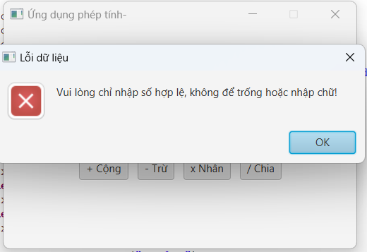

## 1. Simple Calculator — Ứng dụng Phép toán Cơ bản (JavaFX)

📄 [Main.java](application/Main.java)

Ứng dụng máy tính cơ bản hỗ trợ 4 phép toán cộng, trừ, nhân, chia. Tự động kiểm tra lỗi nhập liệu, ngăn chặn lỗi toán học (chia cho 0) và định dạng kết quả hiển thị gọn gàng. Giao diện được căn chỉnh vuông vức, trực quan.

* **Lớp chính:** `Main`
* **Kiến thức:** JavaFX Layout (`GridPane`, `HBox`, `VBox`), Event Handling (Lambda Expression `e ->`), Exception Handling (`try-catch`, `NumberFormatException`), `Alert` Dialog (Hiển thị hộp thoại cảnh báo dạng Modal).

  
  

