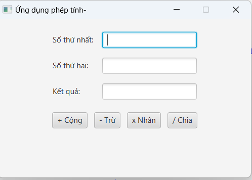

# 66130649-JavaPrograming
Đã thay đổi
-Thay đổi rất nhiều rồi 
* **Lớp chính:** `Main`
* **Kiến thức:** JavaFX Layout (`GridPane`, `HBox`, `VBox`), Event Handling (Lambda Expression `e ->`), Exception Handling (`try-catch`, `NumberFormatException`), `Alert` Dialog (Hiển thị hộp thoại cảnh báo dạng Modal).

  
  

